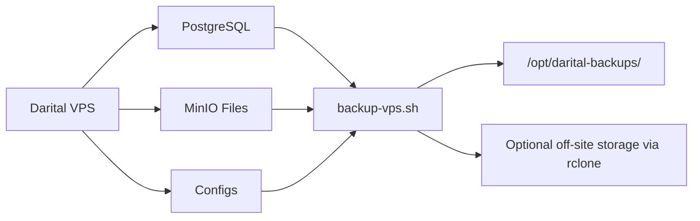

# Darital Backup Guide

This guide defines a minimal but reliable backup system for the current Darital VPS deployment.

## Goals

- Keep PostgreSQL data safe if the VPS fails.
- Keep uploaded files safe if the VPS or MinIO volume is lost.
- Keep deployment configuration safe so the system can be rebuilt quickly.
- Support a simple restore process that can be tested regularly.

## Backup Scope

The backup system covers:

1. PostgreSQL database
2. MinIO uploaded files
3. Deployment configuration

This is separate from the application's archive system. Archive is business retention. Backup is disaster recovery.

## Architecture



## What Gets Created

Each run creates a timestamped directory:

```text
/opt/darital-backups/YYYY-MM-DD_HH-MM-SS/
  db/
    darital.dump
    darital.dump.sha256
  files/
    minio-data.tar.gz
    minio-data.tar.gz.sha256
  configs/
    .env.production
    docker-compose.prod.yml
    docker-compose.vps.yml
    nginx-darital.conf
    nginx.conf
    RESTORE-ORDER.txt
  manifest.txt
```

## Scripts

### Create backup

[`scripts/backup-vps.sh`](/Users/dilbekalmurotov/Desktop/darital/scripts/backup-vps.sh)

### Restore database

[`scripts/restore-db-vps.sh`](/Users/dilbekalmurotov/Desktop/darital/scripts/restore-db-vps.sh)

## Step 1: Prepare the VPS

Create the local backup directory:

```bash
sudo mkdir -p /opt/darital-backups
sudo chown "$USER":"$USER" /opt/darital-backups
```

Make the scripts executable:

```bash
cd ~/darital
chmod +x scripts/backup-vps.sh
chmod +x scripts/restore-db-vps.sh
```

## Step 2: Run the First Manual Backup

From the project root:

```bash
cd ~/darital
./scripts/backup-vps.sh
```

If your environment file is in a different path:

```bash
BACKUP_ENV_FILE=/home/darital/darital/.env.production ./scripts/backup-vps.sh
```

## Step 3: Verify the Backup

List backup directories:

```bash
ls -lah /opt/darital-backups
```

Check the latest backup:

```bash
LATEST=$(ls -1 /opt/darital-backups | sort | tail -n 1)
find "/opt/darital-backups/$LATEST" -maxdepth 2 -type f | sort
```

Verify checksums:

```bash
cd "/opt/darital-backups/$LATEST/db"
sha256sum -c darital.dump.sha256

cd "/opt/darital-backups/$LATEST/files"
sha256sum -c minio-data.tar.gz.sha256
```

## Step 4: Schedule It Daily

Open crontab:

```bash
crontab -e
```

Add this line:

```cron
0 2 * * * cd /home/darital/darital && /home/darital/darital/scripts/backup-vps.sh >> /opt/darital-backups/backup.log 2>&1
```

This runs every day at 02:00.

## Step 5: Add Off-Site Copy

The script supports optional off-site sync through `rclone`.

Install `rclone`, configure a remote, then run:

```bash
BACKUP_RCLONE_REMOTE=myremote:darital-backups ./scripts/backup-vps.sh
```

Recommended remote targets:

- Cloudflare R2
- Backblaze B2
- AWS S3

If `BACKUP_RCLONE_REMOTE` is not set, the script still creates local backups.

## Step 6: Restore Drill

At least once a week, test a restore.

Restore the database from a dump:

```bash
cd ~/darital
./scripts/restore-db-vps.sh /opt/darital-backups/YYYY-MM-DD_HH-MM-SS/db/darital.dump
```

To restore files:

```bash
tar -xzf /opt/darital-backups/YYYY-MM-DD_HH-MM-SS/files/minio-data.tar.gz -C /tmp
```

Then copy them back to MinIO storage if needed.

## Operational Recommendations

- Keep at least 14 daily local backups.
- Keep an off-site copy in a different provider or storage account.
- Do not rely on the application archive system as backup.
- Do not keep the only backup on the same VPS.
- Test restore regularly.

## Next Upgrade Path

This guide is the minimum safe setup.

The next professional upgrade is:

1. PostgreSQL WAL archiving
2. Point-in-time recovery
3. Off-site immutable backups
4. Backup success alerts

## Important Note

The scripts use `docker-compose` because that matches your current VPS operating style.
